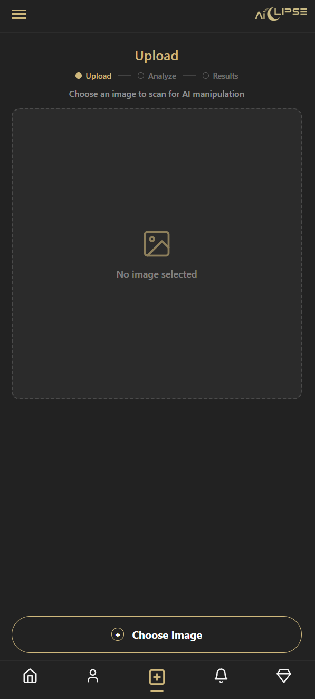
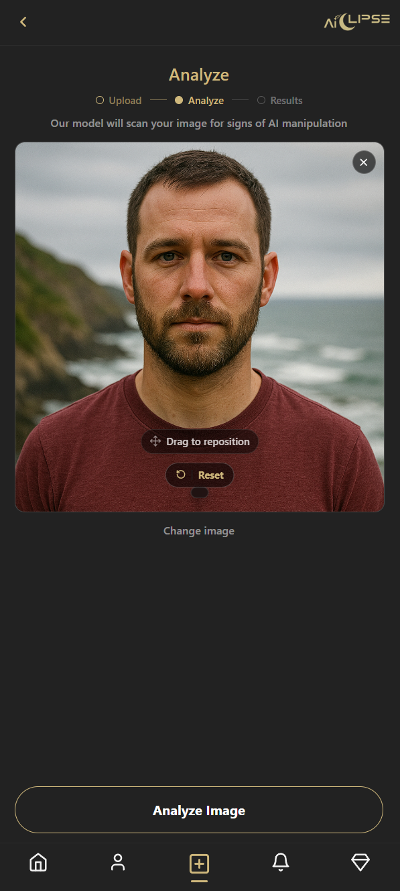
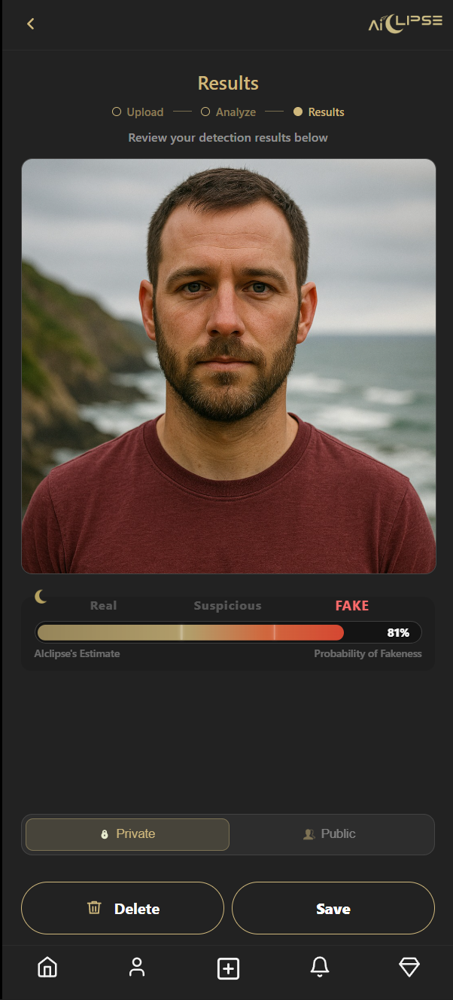
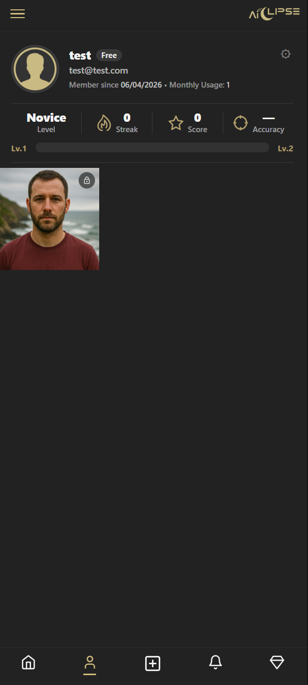
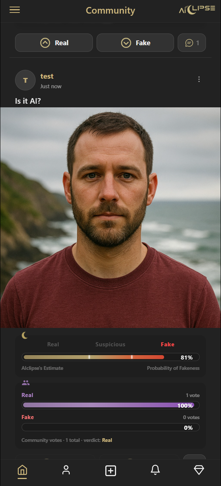
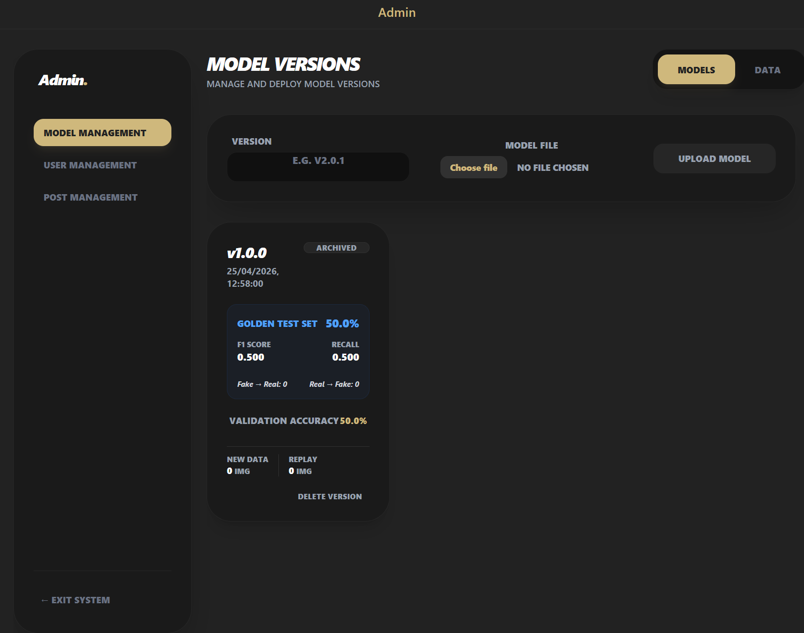

# AIclipse

AIclipse is a polyglot microservices platform for AI image detection.
It combines browser-facing BFFs, a gateway trust boundary, AI inference,
media storage, billing, community features, model lifecycle management, and an
email worker into one Kubernetes-based system.

## What It Does

At a high level, AIclipse gives you:

- AI image detection with verdict, confidence, and model versioning
- image history and private/public media management
- a community feed with posts, comments, votes, moderation, and notifications
- subscription and billing flows
- model upload, deployment, training, and confidence scoring workflows

The current runtime is built around nine services:

| Service | Stack | Role |
|---|---|---|
| `auth` | FastAPI + MongoDB | identity, JWTs, API keys, admin actions |
| `gateway` | FastAPI | trust boundary, auth validation, proxying |
| `client` | Flask | main browser BFF and server-rendered site |
| `community` | Next.js | `/community` UI, internal routes, adminBFF |
| `billing` | FastAPI + MongoDB + Stripe | checkout and billing state |
| `media` | FastAPI + MongoDB + MinIO/S3 | image metadata and presigned URLs |
| `detector` | FastAPI + PyTorch/Transformers | AI inference service |
| `model-cycle` | ASP.NET Core + SQLite + Python | model lifecycle and training |
| `email-worker` | FastAPI + Redis Streams + Gmail | email dispatch worker |

## Screenshots

### Landing Page

### Detection Flow

### Profile

### Community Feed

### Admin Management

_

## Architecture

Public development routing:

- `/` -> `client`
- `/community` -> `community`
- `/api/*` -> `gateway` with ingress rewrite
- `storage.aiclipse.local` -> MinIO/object storage

Core storage:

- MongoDB for documents
- Redis for streams, debounce buffers, and counters
- MinIO for S3-compatible object storage
- SQLite inside `model-cycle` for model metadata

Primary architecture contract:

- [ARCHITECTURE.md](ARCHITECTURE.md)

## Repository Layout

Top-level directories:

- [`auth/`](auth)
- [`billing/`](billing)
- [`client/`](client)
- [`community/`](community)
- [`detector/`](detector)
- [`email-worker/`](email-worker)
- [`gateway/`](gateway)
- [`infra/`](infra)
- [`media/`](media)
- [`model-cycle/`](model-cycle)
- [`swagger-docs/`](swagger-docs)

Key implementation areas:

- `client/routes`, `client/services`, `client/templates`, `client/static`
- `community/app`, `community/lib`, `community/scripts`
- `gateway/app/core`, `gateway/app/routers`
- `auth/app/core`, `auth/app/db`, `auth/app/routers`, `auth/app/services`
- `detector/detector_modules`, `detector/routers`
- `model-cycle/ModelCycle/Controllers`, `Services`, `Repositories`
- `infra/k8s`, `infra/k8s-dev`, `infra/k8s-prod`

## Getting Started

For the full operational guide, local setup steps, exact run commands, and
test/build details, read:

- [Readme.txt](Readme.txt)

Fast path:

1. Enable Kubernetes in Docker Desktop.
2. Add `127.0.0.1 aiclipse.local storage.aiclipse.local` to your hosts file.
3. Install ingress-nginx.
4. Run `skaffold dev` from the repository root.
5. Open `http://aiclipse.local`.

## Build And Test

There is no root `Makefile`.
The intended development path is repository-root `skaffold dev`.

Common local test entry points:

- Python services: `python -m pytest tests -q`
- `client`: `npm test`
- `community`: `npm test`
- `model-cycle`: `dotnet test Tests/Tests.csproj --no-restore --verbosity minimal`

CI/CD entry points live in:

- [`.github/workflows/`](.github/workflows)

## Contracts And Source Of Truth

When in doubt, use this order:

1. [ARCHITECTURE.md](ARCHITECTURE.md)
2. source code and Kubernetes manifests
3. OpenAPI contracts in [swagger-docs/](swagger-docs)

Useful files:

- [ARCHITECTURE.md](ARCHITECTURE.md)
- [Readme.txt](Readme.txt)
- [skaffold.yaml](skaffold.yaml)
- [infra/kustomization.yaml](infra/kustomization.yaml)
- [swagger-docs/](swagger-docs)

## Final Guidance

For normal development, prefer:

- running the full stack with `skaffold dev`
- treating [ARCHITECTURE.md](ARCHITECTURE.md) as the current contract
- using [Readme.txt](Readme.txt) as the operational runbook
- using Kubernetes manifests as the deployment truth
