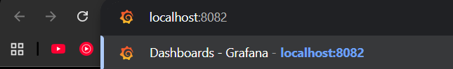
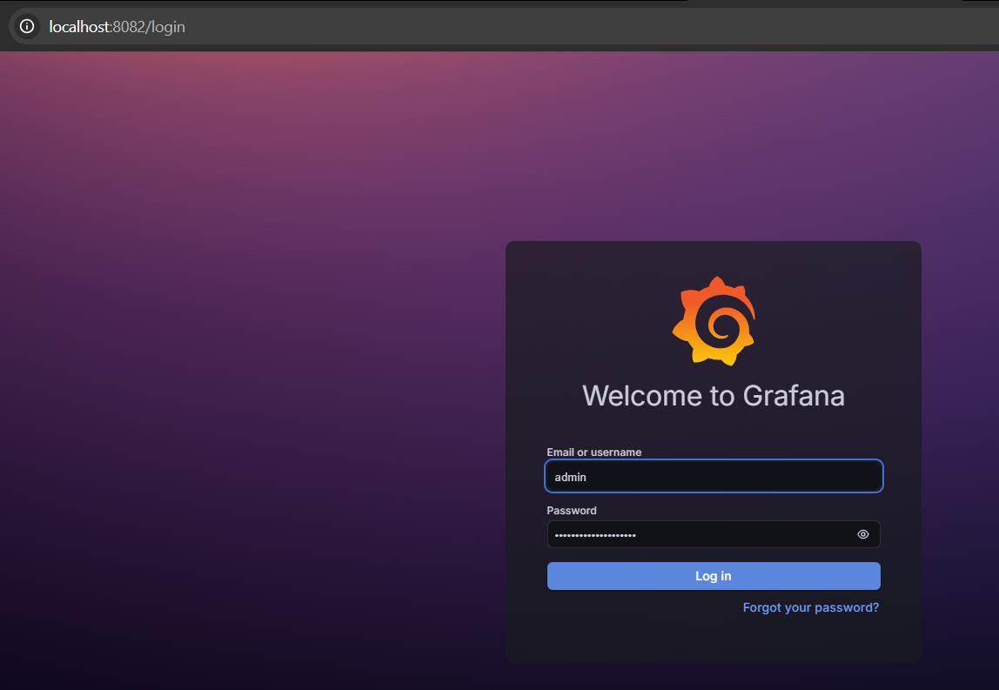
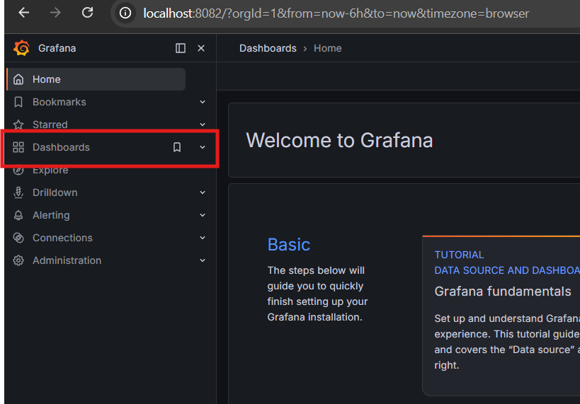
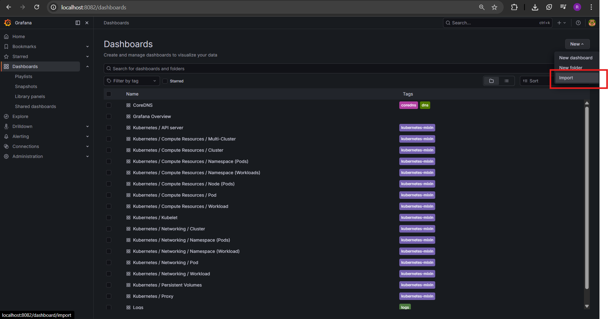
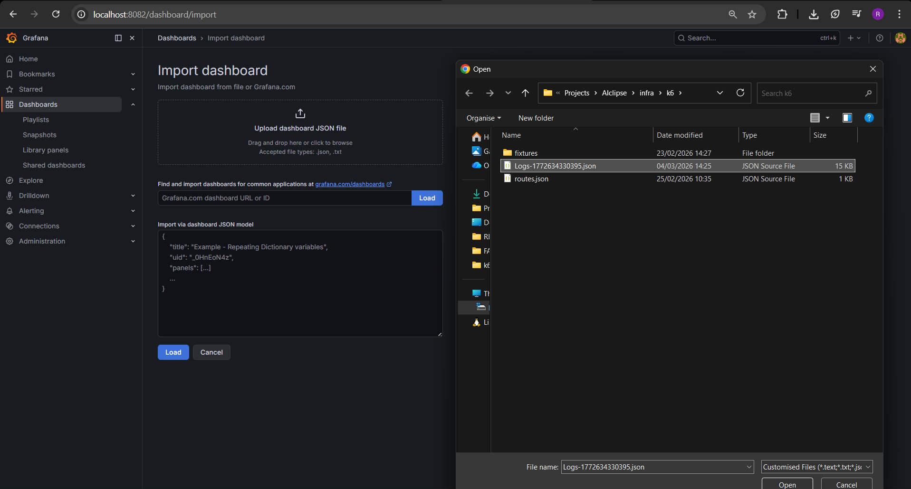
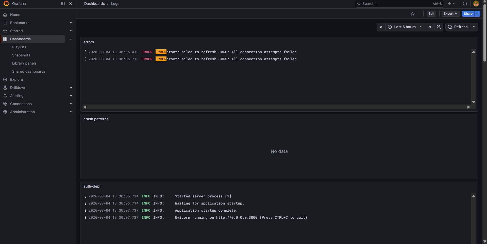

# Install helm and metrcs-server
```
winget install -e --id Helm.Helm
helm version
```

```
kubectl apply -f https://github.com/kubernetes-sigs/metrics-server/releases/latest/download/components.yaml
```

```
kubectl -n kube-system patch deploy metrics-server --type=strategic --patch-file .\infra\k6\ms-patch.yaml
```

```
kubectl -n kube-system rollout restart deploy/metrics-server
kubectl -n kube-system delete pod -l k8s-app=metrics-server
kubectl -n kube-system rollout status deploy/metrics-server --timeout=180s
```


# Glodilocks Setup
```
helm repo add fairwinds-stable https://charts.fairwinds.com/stable
helm repo update

kubectl create namespace goldilocks

helm install goldilocks fairwinds-stable/goldilocks `
  --namespace goldilocks `
  --set vpa.enabled=true
```

# Goldlocks access
```
kubectl -n goldilocks port-forward svc/goldilocks-dashboard 8081:80
```
**And visit localhost:8081**

# Prometheus + Loki + Grafana setup
```
helm repo add prometheus-community https://prometheus-community.github.io/helm-charts
helm repo add grafana https://grafana.github.io/helm-charts
helm repo update

kubectl create namespace monitoring
kubectl create namespace logging
```

```
helm install mon prometheus-community/kube-prometheus-stack `
  -n monitoring `
  -f .\infra\k6\kps-values.yaml

helm install loki grafana/loki-stack `
  -n logging `
  -f .\infra\k6\loki-values.yaml

kubectl -n monitoring get pods
kubectl -n logging get pods
```

Login is `admin` and password you can get with next command
```
$pwd = kubectl -n monitoring get secret mon-grafana -o jsonpath="{.data.admin-password}"
[Text.Encoding]::UTF8.GetString([Convert]::FromBase64String($pwd))
```

# Prometheus + Loki + Grafana access
```
kubectl -n monitoring port-forward svc/mon-grafana 8082:80
```
**And visit localhost:8082**


## Quick check
```
kubectl top pods -A | Select-Object -First 10
kubectl get vpa -n default
kubectl -n goldilocks get pods
kubectl -n monitoring get pods
kubectl -n logging get pods
```







Choose file `infra\k6\Logs-1772634330395.json` and import it.


Done, now you have logs.
